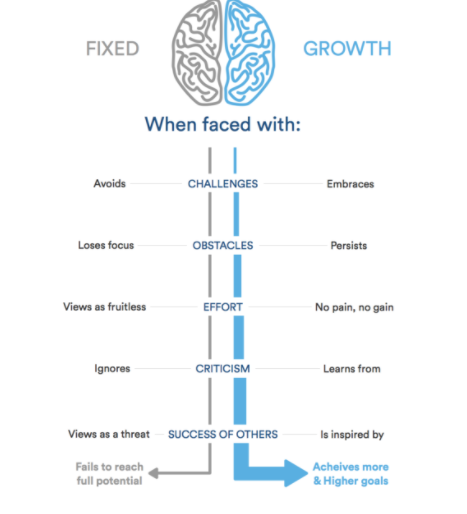

##### What is a growth mindset?
* **growth mindset** means the passion to change and improve yourself  if you have a passion to work, to learn,to gain more and more knowledges with helps intelligence and talent. 
* on other side we have a **fixed mindset** , people with have a fixed mind waiting the opportunity to change their life without Pursue their passion and dreams and be in the comfort zone whithout any effort to evolve themselves. waiting the people to lead them to work and learn . 

Here’s a simple illustration highlighting the differences between a fixed and a growth mindset:

**Perseverance, gumption traps, and maintaining a growth mindset**
1. Challenges : when you faced a problems you should look to the problem form other side , don't force your mind to look with all prloblems from one side , take a step back, and think about the growth mindset. When you are ready, walk through the problem once again, bit by bit, looking for new ways to think about it until I start to see another way forward. *begin to find root causes of the problem*.

2. Obstacles : Disabilities that you may face on your path to development .

3. effort :when you do thing you think is hard and impossible. but all you need is do more effort to finish the mission and achieve it.to feel that you are proud of yourself. every day when you felt tired , ask yourself, Am I giving up too easily? Would I rather shower off pangs of regret, or the sweat of accomplishment? C’mon, the answers are obvious.

4. Criticism:  it useful to review each of my days and assess how I’ve done 

5. Success of others :Make success stories motivation lead to improve yourself

