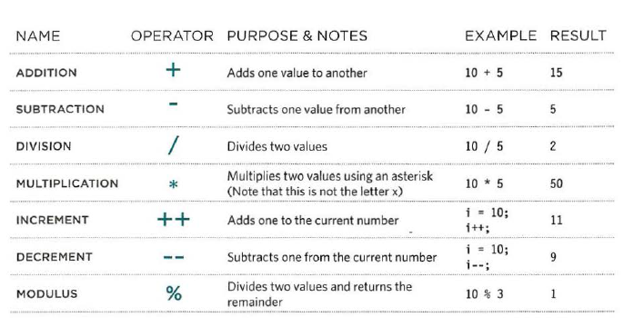

#### Programming with JavaScript 
##### Intro + Scripts
###### why we use JAvaScript :
* allows you to **ACCESS** content .
* allows you to **MODIFY** content .
* **program resuls** while you writing a steps , the browser will following and executing the steps.
* **react** to to events triggered by the user or browser(when you press to any key from keyboard , clicked the mouse , double clicked ,.. all of them called event ) .

###### Exmaples for where we using JavaScript :
* SLIDESHOWS 
* Validating forms
* RELOAD PART OF PAGE
* FILTERING DATA

###### Equivlent Sentences (JS code vs HTML/CSS code):
**HTML/CSS** : `
`
**JS** : ` .p1{color:black};`

##### What is a script :
* A script is a series of instructions that a computer can follow to achieve a goal.
* A script made up of instructons a computer can follow step-by-step.
* A browser may use different parts of the script depnding on how the user interacts with the web page.
* Script can run different sections of the cade in response to the situation around them.

###### steps to write a scipt code :
* first step is determine the goal and then list the tasks that need to be completed in order to achieve it.
1. DEFINE THE GOAL
2. DESIGN THE SCRIPT
3. CODE EACH STEP

* to write a clear code you should learn :
   1. **Vocabulary**:The words that computers understand.
   2. **Syntax**: How you put those words together to create instructions computers can follow.

* what might have gone wrong - programmers call **debugging.**
* Computers approach tasks in a different way than humans, so your instructions must let the computer solve the task prggrammatically.

###### What happens when you entered your name inside imput feild and press to btn (ok)?
1. The script is triggered when the button is clicked.
2. It collects the name entered into the form field.
3. It checks that the user has entered a value.
4. If the user has not entered anything, a message will appear telling them to enter a name.

##### Expressions + Operators:
###### EXPRESSIONS :
        * there are two types of expressions:
            1. EXPRESSIONS THAT JUST ASSIGN A VALUE TO A VARIABLE ` var name="aya" `
            2. EXPRESSIONS THAT USE TWO OR MORE VALUES TO RETURN A SINGLE VALUE ` var area =5*2 `. the value that stored in area var is 10 .

###### OPERATORS :
   *  ASSIGNMENT OPERATORS `name= "aya" ; ` here we assgin the value to the variable.
   *  ARITHMETIC OPERATORS ` area = 3 * 2; `   
   *  STRING OPERATORS ` fullName ='aya'+'alasmar' ;` Also MIXING NUMBERS AND STRINGS equal STRING ` '5' + 5 = 55 ` , the result '55' is string.
   *  COMPARISON OPERATORS `buy = 3 > 5;`
   *  LOGICAL OPERATORS ` buy= (5 > 3) && (2 < 4);`

###### Mathematical operators in JavaScript:
 

* **ORDER OF EXECUTION :**
     1. parentheses.
     2. Multiplication and division .
     3. addition or subtraction.
* Arrays are special types of variables that store more than one piece of related information.

##### Functions :
   * **functions and methods** :function indicate to set of statements that written for acheive specific gaol.
   * **OBJECTS** :

        
     
    